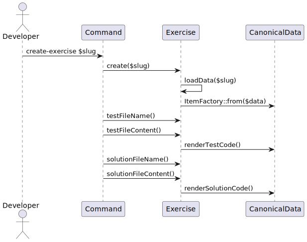

# PHP code generator for Exercism PHP track exercises

- [Introduction](#introduction)
- [Architecture](#architecture)
- [Contribution](#contribution)

## Introduction

This is a simple code generator for practice exercises in the PHP track based on the [Exercism common problem specifications][exercism-problem-specifications].

> Please read and think about the exercise instructions!
> Many problems require additional test failure messages and useful information to help students solve the exercise.
> Generating code is not "being done"!

The majority of problems in problem specifications are *function oriented*.
That means, all input goes into a single function call and no state of an object changes expected results.
So the generator generates *function oriented* code.
A fresh instance is created with no constructor arguments in `setUp()` for each test.
The tests invoke methods with the input and compare actual results with expectations.

If the problem you generate code for requires object orientation, adjust the tests manually (e.g. replace `$this->subject->`).

The next decision to make is: How much freedom of implementation shall students have?
For practice exercises we usually give maximum freedom of implementation.
This freedom must be designed into the student facing interface.
But there are good reasons to limit the freadom of choice.
Has PHP an idiomatic way to solve such a class of problems?
Like using an `enum` for certain result types.
Then you should design that into the interface.

Mentoring is done to guide students towards "recommended" implementations.
Some exercises do require stricter boundaries, like "Do not use language provided functions to solve this".
Such restrictions need to be implemented manually.

Another decision required is the amount of prepared student interface code you want.
The generator only produces the bare minimum, an empty class with a throwing constructor.
This is a pragmatic choice, it is easy to implement. 🙂
Adding predefined methods lowers the difficulty of the exercise.
Testing for type declarations being set and / or testing for type safety raises the difficulty.
So it is your choice, if you want to do so or not.

Now you have made the basic decisions. Time to use the generator!

- Follow the track README to install track tooling (`configlet`)
- Run from track root:

  ```shell
  bin/configlet create --practice-exercise '<slug>'
  composer -d contribution/generator install
  contribution/generator/bin/console app:create-tests '<slug>'
  composer lint:fix
  vendor/bin/phpunit exercises/practice/'<slug>'/*Test.php
  ```

- Run `git status` to see all the generated files.
  These are yours now.
- Adjust the code as required.
- Add more information to `.meta/*.append.md`.
  The generated files `.meta/*.md` are kept in sync with problem specifications.
- Mark tests not implemented with `include = false` in `tests.toml`.
- Open a PR to get feedback on your exercise **early**.

## Architecture

The `Exercise` interface supports both types of exercises, `PracticeExercise` and the planned `ConceptExercise`.
For both exercise types, the test file and the students file are generated from `configlet` generated directory structures and files.
It is planned to use a `canonical-data.json` similar to the problem specification for the concept exercises, too.

Between the symfony command(s) and the actual test / students file generation is the test boundary `ItemFactory`.
By this, the integration testing (not yet implemented) needs to test only, that the expected files are generated with some sample text.
The actual details of test / student file generation can be tested without mocking the filesystem or booting the symfony kernel.



`configlet` is used by `PracticeExercise`, wrapped in an own class.
This is because the [cached problem specifications][exercism-problem-specifications] is required and `configlet` knows best where to find that.
The actual path differs depending on the underlying operating system, and we shouldn't copy that from `configlet` sources.

We started with an implementation walking through the raw JSON data and used `nikic/php-parser` to produce PHP code from that.
This hided the underlying data structures used to construct the varying canonical data sets in the problem specification.
So we made them explicit:

- `Item`s are all data structures to construct the varying canonical data sets (interface).
- `ItemFactory` turning raw data into the matching `Item` (object).
- `Unknown` represents data structures that do not follow a known schema (object).
- `TestCase`s represent tests with input and expected outcome of the students code (object).
- `Group`s are sets of `Item`s, that share a common theme and may have some title, explanation and folding section markers (object).
- `InnerGroup`s are the pure lists of `Item`s to convert to tests (object).
- `CanonicalData` is the outermost group with the expected extra data for an exercise and an `InnerGroup` with `Item`s (object).


This allows to represent the JSON data as a tree of groups and test cases.
Every data structure object examines the raw data and produces an instance only, if it can handle that structure.
The tree is built using `ItemFactory`, which starts with the most specific data structure `CanonicalData` and goes out towards `Unknown` until an instance is made from the raw data given.
Having all unknown data catched into an `Unknown` allows rendering any structure found into the output files.

Such a tree structure looks like doing the code production with the "visitor" pattern.
But that pattern comes with a huge cost of complexity and should only be used, if the tree will have multiple visitors.
So the simple way of iterating directly over the tree to produce the output from the data objects is prefered.

Also it is tempting to implement a transformation logic "data -> abstract syntax tree", which we had with `nikic/php-parser`.
But this also adds a huge amount of complexity for no real win - the AST would only be used for pre-defined code output.
Predefined code snippets - code templates with placeholders for the data given - are much simpler and allow direct control of formatting.
Templates also don't require special knowledge about the AST library used.
Simply edit the template using IDEs and other tools like any other file.
For our purpose of producing code, that **should be** verified and corrected by humans, templates are the best solution.

[exercism-problem-specifications]: https://github.com/exercism/problem-specifications/

## Contribution

To get ready to contribute to the generator, run these commands:

```shell
cd contribution/generator
composer install
vendor/bin/phpunit
```

- Add unit tests for changes to `TrackData` classes
- Document changes in [Introduction](#introduction) and [Architecture](#architecture)

### Architecture Diagrams

Use [PlantUML](http:://plantuml.com/) to add / modify diagrams.
